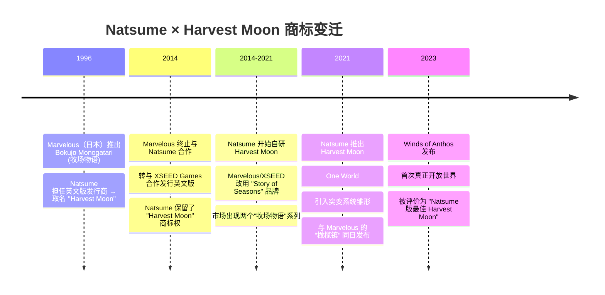

# 团队与开发历程 — 中秋之月: 季风之息 (Harvest Moon: The Winds of Anthos)

> 游戏版本: Harvest Moon: The Winds of Anthos (PC/Steam/Switch/PS5/Xbox Series, Natsume, 2023年9月26日)
> 来源: [Natsume Official](https://www.natsume.com/) | [Wikipedia HM](https://en.wikipedia.org/wiki/Harvest_Moon:_The_Winds_of_Anthos) | [Steam Store Page](https://store.steampowered.com/app/2168450/Harvest_Moon_The_Winds_of_Anthos/) | [IGN Review](https://www.ign.com/articles/harvest-moon-winds-of-anthos-review) | [Nintendo Life Review](https://www.nintendolife.com/reviews/switch/harvest-moon-the-winds-of-anthos)

## 一、开发商背景：Natsume 的转型史

### 1.1 公司概况

| 信息 | 内容 |
|:----:|------|
| **公司名称** | Natsume Inc. |
| **总部** | 美国加利福尼亚州伯灵格姆 |
| **成立时间** | 1987 年 |
| **创始人** | 前田寻之（Hiro Maekawa）等 |
| **主要业务** | 电子游戏开发和发行 |

### 1.2 Natsume 与 Harvest Moon 商标的传奇关系

> Natsume 保留商标但失去配方——这是一个引人注目的游戏产业案例。"Harvest Moon"这个名字在西方市场拥有20年品牌积累，但 Natsume 没有原开发团队（Marvelous）的制作经验。2014年分家后，Natsume 必须从零建立自己的牧场游戏开发能力。

## 二、团队与开发

### 2.1 Winds of Anthos 的开发背景

| 维度 | 说明 |
|:----:|------|
| **开发商** | Natsume Inc.（内部开发团队） |
| **发行商** | Natsume Inc. |
| **开发周期** | 推测 2-3 年（2021-2023，One World 发售后启动） |
| **团队规模** | Natsume 内部团队（具体人数未公开） |
| **开发平台** | PC / Switch / PS4 / PS5 / Xbox One / Xbox Series |
| **引擎** | 未公开 |

### 2.2 分家后作品进化

| 作品 | 年份 | 关键评价 | Winds of Anthos 的改进 |
|:----:|:----:|:--------:|:---------------------:|
| Harvest Moon: The Lost Valley | 2014 | 评分低/玩法简陋 | — |
| Harvest Moon: Seeds of Memories (移动) | 2016 | 评价一般 | — |
| Harvest Moon: Skytree Village | 2016 | 略有改进 | — |
| Harvest Moon: Light of Hope | 2017 | 逐步成熟 | — |
| Harvest Moon: One World | 2021 | 首次跨区域旅行 | 突变系统先祖 |
| **Harvest Moon: The Winds of Anthos** | **2023** | **Natsume 版最佳** | **开放世界+成熟突变系统** |

> 从上表可以清晰看到 Natsume 自研 Harvest Moon 的进化路线：从 The Lost Valley 的完全失败，到 Light of Hope 的逐步成熟，再到 One World 的世界探索雏形，最终在 Winds of Anthos 实现了开放世界和突变系统的成熟整合。

## 三、Winds of Anthos 核心创新

### 3.1 从 One World 到 Winds of Anthos

| 维度 | One World (2021) | Winds of Anthos (2023) | 进步 |
|:----:|:----------------:|:----------------------:|:----:|
| **世界结构** | 区域传送（有加载） | **开放世界（无缝）** | 巨大提升 |
| **突变系统** | 基础版本 | **完善版本（更多品种）** | 显著丰富 |
| **农场数量** | 区域各有小农场 | **8个专用农场** | 大幅增加 |
| **候补数量** | 较少 | **10+2 (DLC)** | 丰富 |
| **画面表现** | Switch 时代标准 | **显著提升** | 优化升级 |
| **DLC 支持** | 有 | **5个DLC** | 更全面 |

### 3.2 行业评价

| 评价来源 | 评分/评语 | 关键点 |
|:--------:|:---------:|:------:|
| **IGN** | 评语待引述 | 首次开放世界是最大亮点 |
| **Nintendo Life** | 评语待引述 | 突变系统为系列注入新活力 |
| **Steam 评价** | 多半好评（具体数值随时间变化） | 社区反馈整体正面 |
| **Metacritic** | 分数待查询 | 多数媒体评分为系列最高之一 |

> 注意：具体的媒体评分和评语在资料收集时未完整记录。Winds of Anthos 被普遍认为是 Natsume 分家后的最佳作品，但具体的 Metacritic/Opencritic 分数——建议读者查询最新数据。

## 四、市场表现与发行

| 平台 | 发行日期 | 数字版 | 实体版 |
|:----:|:--------:|:------:|:------:|
| **Nintendo Switch** | 2023年9月26日 | eShop | 零售 |
| **PlayStation 5** | 2023年9月26日 | PSN | 零售 |
| **PlayStation 4** | 2023年9月26日 | PSN | 零售 |
| **Xbox Series X/S** | 2023年9月26日 | Microsoft Store | 零售 |
| **Xbox One** | 2023年9月26日 | Microsoft Store | 零售 |
| **PC (Steam)** | 2023年9月26日 | Steam | — |

### 4.1 定价历史

| 版本 | 发行价格 | 当前参考价格 |
|:----:|:--------:|:-----------:|
| **标准版** | $49.99 USD | 待查 |
| **DLC (5个)** | 各 $4.99-$9.99 假设 | 待查 |
| **完整版(含DLC)** | 无单个完整包 | 需单独购买 |

> 具体定价因平台和区域有所不同，建议查看各商店实时价格。

## 五、DLC 策略

| DLC 名称 | 主要内容 | 发行时间 |
|:--------:|:--------:|:--------:|
| **Animal Avalanche** | 新动物类型 | 发售后 |
| **Visitors From Afar** | 2位新候补 + 新区域 | 发售后 |
| **Tools & Interiors** | 工具升级扩展 + 室内装饰 | 发售后 |
| **Crops, Fish & Recipes** | 新作物 + 鱼类 + 配方 | 发售后 |
| **Great Outdoors** | 户外装饰/设施 | 发售后 |

> DLC 策略的评价：5 个 DLC 分别覆盖了游戏的不同内容模块。这种模式让玩家可以按需选购，但也引发了"基础版内容是否完整"的讨论。

## 六、设计与开发理念分析

### 6.1 Winds of Anthos 的核心设计目标

| 目标 | 实现方式 | 评价 |
|:----:|:--------:|:----:|
| **打破传统牧场约束** | 开放世界+跨季种植+突变系统 | 成功差异化 |
| **探索驱动** | Wisp收集+隐藏突变+多个农场 | 策略层面成功 |
| **丰富终局内容** | 多农场+全突变+DLC | 中等（DLC分割内容） |
| **回溯粉丝需求** | 增加候补、开放世界 | 部分满足 |

### 6.2 与 Marvelous Story of Seasons 的竞争

| 对比 | Natsume Harvest Moon | Marvelous Story of Seasons |
|:----:|:--------------------:|:--------------------------:|
| **品牌历史** | 1996-2014年发行，2014-自研 | 1996-至今开发 |
| **核心团队** | Natsume 内部（美国） | Marvelous（日本） |
| **代表作品** | Winds of Anthos | 橄榄镇、牧场物语系列 |
| **系列风格** | 开放世界+突变+创新 | 传统优化+细节打磨 |
| **市场口碑** | 分家后逐步提升 | 保持稳定但"创新不足" |

> Winds of Anthos 的意义在于证明了 Natsume 可以独立做出有竞争力的牧场游戏——不再是"商标持有者"而是"有实力的开发者"。

---

> **数据真实性声明**：本文开发团队信息基于 2014 年以来公开报道的 Natsume 公司历史。具体团队规模、开发周期等数据未得到 Natsume 官方确认——标注为"推测"和"未公开"。媒体评分引用为概要性描述，具体打分建议查阅 Metacritic 或各媒体官方网站。定价为发行时的建议零售价，当前实际价格因平台和时间而不同。
