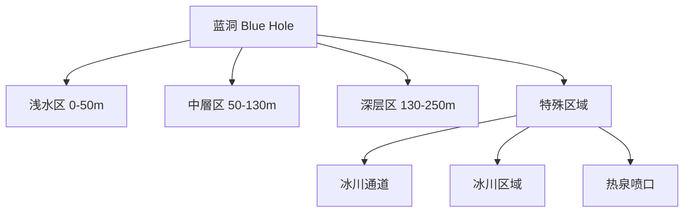

# 鱼类与深度数据 - 潜水员戴夫(Dave the Diver)

> 游戏版本: Dave the Diver v1.0+ (PC/Switch, 2023年)
> 数据来源: [Dave the Diver Fandom Fish Wiki](https://dave-the-diver.fandom.com/wiki/Fish), [ProGameGuides Fish List](https://progameguides.com/dave-the-diver/dave-the-diver-fish-list/), [Neoseeker Full Marinca](https://www.neoseeker.com/dave-the-diver/Every_Fish_(Full_Marinca)), [NoobFeed Fish Guide](https://noobfeed.com/articles/dave-the-diver-all-fish)

---

## 一、蓝洞(Blue Hole)生态系统总览

蓝洞分为三大深度层+五个特殊生态区。每个区域有独特的鱼种、资源分布和危险等级。Marinca图鉴共计收录**120+种鱼类和生物**。

---

## 二、详细鱼种与深度分布

### 2.1 浅水区(Shallows, 0-50m)

**白天鱼种(40+种)**——新手区，适合初期积累:

| 鱼种 | Rank | 品质 | 星级价值 | 推荐捕获 | 备注 |
|:---:|:----:|:----:|:--------:|:--------:|:----:|
| 小丑鱼(Clownfish) | 1 | 1-3星 | 低 | 网枪 | 基础寿司材料 |
| 蓝唐鱼(Blue Tang) | 1 | 1-3星 | 低 | 网枪 | 初期主力菜品 |
| 黄唐鱼(Yellow Tang) | 1 | 1-3星 | 低 | 网枪 | 同上 |
| 鹦鹉鱼(Parrotfish) | 1 | 1-3星 | 低 | 网枪 | 烤鱼材料 |
| 条纹濑鱼(Rainbow Wrasse) | 1 | 1-3星 | 低 | 网枪 | 基础食材 |
| 箱水母(Box Jellyfish) | 2 | 1-3星 | 中 | 网枪 | 水母沙拉 |
| 海胆(Purple Sea Urchin) | 5 | 固定 | 中高 | 手拾 | 特定食谱 |
| 狮子鱼(Red Lionfish) | 2 | 1-3星 | 中 | 麻醉枪 | 危险但高价值 |
| 黄鳍金枪鱼(Yellowfin Tuna) | 5 | 1-3星 | **高** | 麻醉枪 | 高级寿司 |
| 白腿虾(Whiteleg Shrimp) | 5 | 1-3星 | 中高 | 网枪 | 虾类食谱 |
| 条纹鲶鱼(Striped Catfish) | 5 | 1-3星 | 中 | 麻醉枪 | 特定菜品 |
| 短鳍灰鲭鲨(Shortfin Mako) | 8 | 1-3星 | **很高** | 麻醉枪 | Boss级 |
| 旗鱼(Marlin) | 8 | 1-3星 | **很高** | 麻醉枪 | Boss级 |
| 长尾鲨(Thresher Shark) | 9 | 1-3星 | **极高** | 麻醉枪 | 终局 |

**夜间专属**(剧情解锁后):

| 鱼种 | Rank | 说明 |
|:---:|:----:|:----:|
| 黑鳍礁鲨(Blacktip Reef Shark) | 6 | 夜间鲨鱼 |
| 铜鲨(Copper Shark) | 6 | 夜间威胁 |
| 斑马鲨(Zebra Shark) | 8 | 高价值夜间目标 |
| 裸胸鳝(Moray Eel) | 5 | 洞穴潜伏者 |
| 箱水母(夜间变种) | 5 | 危险水母 |
| 洪堡鱿鱼(Humboldt Squid) | 8 | 夜间限定 |

**摄影目标**(非捕鱼,完成Marinca图鉴):

| 目标 | 出现条件 |
|:----:|:--------:|
| 座头鲸宝宝(Baby Humpback Whale) | 白天 |
| 粉海豚(Pink Dolphin) | 白天 |
| 蝠鲼(Manta Ray) | 夜间 |
| 蠵龟(Loggerhead Turtle) | 白天 |
| 蝙蝠鱼(Red-Lipped Batfish) | 夜间 |

**浅水区Boss**:
- Truck Hermit Crab(寄居蟹Boss)
- Mantis Shrimp(螳螂虾Boss)
- Klaus the Great White Shark(大白鲨)

---

### 2.2 中层区(Medium Depth, 50-130m)

**白天鱼种**——鲨鱼和大型鱼开始出现:

| 鱼种 | Rank | 危险度 | 推荐方式 | 用途 |
|:---:|:----:|:------:|:--------:|:----:|
| 石斑鱼(Dusky Grouper) | 3 | ★★ | 麻醉枪 | 高级烤鱼 |
| 蓝纹鲹(Giant Trevally) | 4 | ★★★ | 麻醉枪 | 生鱼片 |
| 狐鲣(Atlantic Bonito) | 3 | ★★ | 鱼叉/麻醉 | 基础菜 |
| 乌贼(Cuttlefish) | 2 | ★ | 网枪 | 鱿鱼类食谱 |
| 马鲛鱼(Narrow-Barred Spanish Mackerel) | 3 | ★★ | 麻醉枪 | 高级寿司 |
| 角安康(Atlantic Anglerfish) | 4 | ★★★ | 麻醉枪 | 钟乳洞限定 |
| 虎鲨(Tiger Shark) | 6 | ★★★★ | 麻醉枪 | 高价值 |
| 大梭鱼(Great Barracuda) | 3 | ★★ | 鱼叉 | 普通 |
| 锯鲨(Longnose Sawshark) | 6 | ★★★★ | 麻醉枪 | 高价值 |

**沉船内部专属**:

| 鱼种 | Rank | 说明 |
|:---:|:----:|:----:|
| Sally Lightfoot Crab | 7 | 沉船内 |
| 黑虎虾(Black Tiger Shrimp) | 5 | 沉船内 |
| 旗鱼(Sailfish) | 9 | 沉船内,Boss级 |
| 锤头鲨(Smooth Hammerhead) | 9 | 沉船内 |

**夜间专属**:
- 洪堡鱿鱼(Humboldt Squid, Rank 8)——危险的群居捕食者
- 魔鬼蝎子鱼(Devil Scorpionfish, Rank 8)——剧毒

**中层Boss**:
- Giant Squid(巨型鱿鱼)——沉船内部,夜间

---

### 2.3 深层区(Depths, 130-250m)

**深海鱼种**——高Rank高价值,环境昏暗危险:

| 鱼种 | Rank | 价值 | 说明 |
|:---:|:----:|:----:|:----:|
| 鹦鹉螺(Chambered Nautilus) | 5 | 中高 | 活化石 |
| 尖牙鱼(Fangtooth) | 5 | 中 | 小型深海鱼 |
| 皱鳃鲨(Frilled Shark) | 7 | **很高** | 深海活化石 |
| 星斑镊鱼(Bluespotted Stargazer) | 6 | 高 | 剧毒 |
| 银鲛(Rhinochimaeridae) | 6 | 高 | 深海幽灵 |
| 蜘蛛蟹(Spider Crab) | 6 | 高 | 大型甲壳类 |
| 巨口鲨(Megamouth Shark) | 7 | **很高** | 稀有 |
| 雪人蟹(Cookiecutter Shark) | 6 | 高 | 寄生性 |
| 海蝶(Clione) | 5 | 中 | 小型 |
| 蟾鱼(Sea Toad) | 5 | 中 | 深海 |
| 太平洋旗鱼(Pacific Fanfish) | 5 | 中 | — |
| 三齿鲀(Threetooth Puffer) | 5 | 中 | 有毒 |
| 栉水母(Comb Jelly) | 6 | 中高 | 深海发光 |
| 红鲷(Red Bream) | 5 | 中 | — |

**深层区特性**:
- ❌ **无夜间潜水**(太暗无法潜水)
- 地形固定(不同于浅/中层的随机地形)
- **海人村落入口**位于此层
- 需要潜水服Lv4(250m)以上

**摄影目标**:
- Opah(月鱼)/皇带鱼(Oarfish)/棱皮龟(Leatherback Turtle)

**深层Boss**:
- Clione Queen(海蝶女王)
- Giant Wolf Eel(巨型狼鳗)
- Goblin Shark(欧氏尖吻鲨)

---

### 2.4 冰川通道(Glacier Passage)

Ch5解锁,连接海人村落与冰川区域的过渡地带:

| 鱼种 | Rank | 说明 |
|:---:|:----:|:----:|
| 孔雀鱿(Peacock Squid) | 7 | 发光鱿鱼 |
| 小飞象章鱼(Dumbo Octopus) | 7 | 稀有章鱼 |
| 桶眼鱼(Barreleye) | 7 | 透明头部的深海鱼 |
| 水滴鱼(Blobfish) | 7 | 知名深海鱼 |
| 吸血鱿(Vampire Squid) | 8 | 深海吸血鬼 |
| 鹈鹕鳗(Pelican Eel) | 9 | 深渊鳗鱼 |

---

### 2.5 冰川区域(Glacial Area)

Ch6解锁,深度约540m的寒冷区域:

| 鱼种 | Rank | 特殊说明 |
|:---:|:----:|:--------:|
| 北极鳕(Arctic Cod) | 8 | 基础冰川鱼 |
| 凝胶狮子鱼(Gelatinous Snailfish) | 8 | 适应低温 |
| 南极章鱼(Antarctic Octopus) | 9 | 高价值 |
| 格陵兰鲨(Greenland Shark) | 9 | 顶层捕食者 |
| 北极鳕鳗(Polar Eelpout) | 8 | — |
| 鼠鲨(Porbeagle Shark) | 9 | 高价值 |
| 冰鱼(Ice Fish) | 8 | 透明血液 |
| 毛鳞鱼(Capelin) | 8 | 群游 |
| 独角鲸(Narwhal) | 9 | 极高价值 |
| 黑线鳕(Haddock) | 8 | — |
| 星形鳐(Starry Skate) | 9 | 稀有大鳐 |

**冰川洞穴专属**: 北极望远镜鱼(Arctic Telescope Fish)、黄线狭鳕(Alaska Pollock)、圆鳍鱼(Lumpfish)、吻棘鳅(Snub-nosed Spiny Eel)

**冰川Boss**: Phantom Jellyfish(幻影水母)

---

### 2.6 热泉喷口(Hydrothermal Vents)

Ch7解锁的终局区域,极高Rank的史前鱼类:

| 鱼种 | Rank | 说明 |
|:---:|:----:|:----:|
| Waptia Fieldensis | 9 | 寒武纪化石鱼 |
| 皮卡鱼(Pikaia) | 9 | 脊索动物祖先 |
| Allenypterus | 9 | 史前腔棘鱼 |
| 青门鱼(Qingmendous) | 9 | 大型史前鱼 |
| Falcatus | 9 | 史前鲨鱼 |
| Drepanaspis | 9 | 史前甲胄鱼 |
| 邓氏鱼(Dunkleosteus) | 9 | 顶级史前捕食者 |
| Xenacanthus | 9 | 史前淡水鲨 |
| Megalograptus | 9 | 巨型海蝎子 |

**摄影目标**: 阿兰达鱼(Arandaspis)、腔棘鱼(Coelacanth)

**热泉Boss(终局三连)**:
- Helicoprion(旋齿鲨)
- Kronosaurus(克柔龙)
- Yawie(最终Boss)

---

## 三、品质与星级系统

### 3.1 捕鱼品质决定因素

| 品质 | 捕获方式 | 鱼肉量 | 售价倍率 | 推荐方法 |
|:---:|:--------:|:------:|:--------:|:--------:|
| 1星 | 鱼叉击杀 | 基础 | ×1.0 | 纯战斗 |
| 2星 | 精准击杀/爆头 | 中等 | ×1.3 | 瞄准弱点 |
| **3星(完美)** | **活捉** | **最高** | ×**1.6-2.0** | 网枪/麻醉枪 |

### 3.2 3星活捉方法论

| 鱼种类型 | 推荐武器 | 技巧 |
|:--------:|:--------:|:----:|
| 小型鱼群 | Small/Medium Net Gun | 一网打尽 |
| 中型鱼 | Large/Steel Net Gun | 单发捕获 |
| 大型鱼(鲨鱼等) | Hush Dart→麻醉 | 先麻后摸 |
| Boss级 | 麻醉狙击枪(Red Sniper麻醉分支) | 远程安全麻醉 |

**3星鱼的经济价值**: 以金枪鱼为例——1星售价约80g,3星售价可达160g+,翻倍收益。高端菜品(如Boss料理)对3星食材需求更大。

---

## 四、生态设计分析

### 4.1 深度分层设计

| 特征 | 浅水(0-50m) | 中层(50-130m) | 深层(130-250m) | 冰川(540m+) |
|:---:|:----------:|:-------------:|:--------------:|:----------:|
| 鱼种数 | 40+种 | 30+种 | 20+种 | 25+种 |
| 平均Rank | 1-3 | 3-6 | 5-7 | 8-9 |
| 危险等级 | 低 | 中 | 高 | 极高 |
| 随机地形 | 是 | 是 | 固定 | 固定 |
| 夜间探索 | 可 | 可 | 不可 | 不可 |
| 剧情解锁 | 初始 | 潜水服Lv2 | 潜水服Lv4 | Ch5+ |

### 4.2 设计亮点

1. **难度梯度不是线性的**: 不像传统游戏"新区域=高等级怪",蓝洞的深度设计让玩家"看得到但够不着"——激发探索欲和安全感的矛盾。

2. **随机地形产生重玩性**: 浅中层每日刷新的地形、宝箱、资源点分布——Roguelite式的地图生成让每次潜水都有新鲜感,但又不会像《黑帝斯》那样完全随机(鱼种分布是固定的)。

3. **昼夜循环改变生态**: 夜间潜水不是简单的"暗一点",而是整个鱼种群落替换——给了玩家充分的理由在不同时段重复探索同一区域。

4. **摄影目标=探索引导**: 稀有海洋生物的摄影任务是隐形的探索引导系统——玩家为了拍到皇带鱼会主动探索更深处,而不是被动等任务指示。

### 4.3 跨游戏对比

| 维度 | 潜水员戴夫 | 深海迷航(Subnautica) | 动物进行曲 |
|:---:|:----------:|:-------------------:|:----------:|
| 生态区数量 | 6大区域 | 10+生物群系 | 4-5区域 |
| 深度系统 | 4层(0-800m) | 开放式深海 | 多层矿洞 |
| 每日随机 | 浅中层随机 | 完全固定 | 部分随机 |
| 采集目的 | 食材+金币 | 生存材料 | 出货赚钱 |
| 生态多样性 | 120+种 | 30+种 | 60+种 |
| 夜间系统 | 鱼种替换 | 掠食者活跃 | 无 |

---

> **设计意图分析**: 鱼类与深度系统的核心是**创造一个值得每天探索的动态海洋世界**。随机地形+昼夜差异+深度推进=三种变化维度叠加,让60+小时的游戏时间内不会产生重复感。每个鱼种不仅是"资源",更是菜单上的一道菜、图鉴里的一张照片、以及通往下一深度区域的生态线索。这种"探索→收集→转化→升级→探索更深"的循环,是Dave the Diver能维持长期吸引力的底层引擎。
